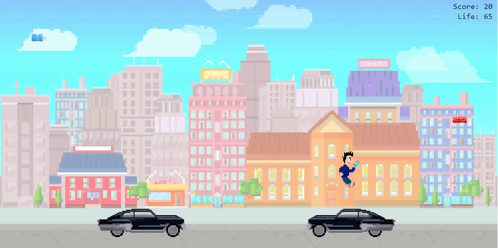

# jogo-do-ganso

Mini game 2D, desenvolvido em Javascript e JQuery

## Como jogar

1. Clone o repositório;
2. Abra o arquivo src/index.html em qualquer navegador;
3. Jogue! :)

## Objetivo

O joguinho foi desenvolvido em homenagem a um amigo que adora Coca-Cola e não sai do celular, haha!
O objetivo é sobreviver o máximo de tempo possível nas ruas da cidade, evitando ser atropelado pelos carros, e evitando as garrafas de água mineral que caem do céu.
Coletar as latas de Coca-Cola restauram uma parte da vida.

## Controles

Use os direcionais do seu teclado para movimentar o Ganso para esquerda ou direta, e para saltar.
